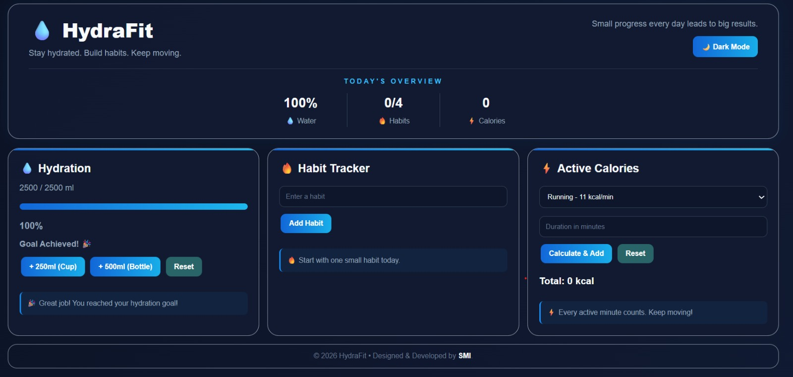

# HydraFit 💧

### Daily Health & Habit Tracker

HydraFit is a simple and responsive web application designed to help users track their **daily water intake, habits, and active calories** in one place.

The project focuses on practicing core **HTML, CSS, and JavaScript** concepts while creating a useful real-world dashboard.

## 📸 Project Preview



## ✨ Features

* 💧 Track daily water intake
* 📊 Visual water progress indicator
* 🔥 Create and track daily habits
* 📈 Track habit streaks
* ⚡ Calculate active calories based on activity and duration
* 💾 Save data using LocalStorage
* 🌙 Dark/Light mode
* 📱 Responsive design for different screen sizes
* 🔄 Reset water and calorie progress
* 💬 Motivational messages based on progress

## 🛠️ Technologies Used

* HTML5
* CSS3
* JavaScript
* DOM Manipulation
* LocalStorage
* CSS Grid & Flexbox
* Responsive Media Queries

## 📂 Project Structure

```text
HydraFit/
│
├── index.html
├── style.css
├── script.js
└── README.md
```

## 🚀 How to Run

1. Clone the repository:

```bash
git clone https://github.com/Smi-abbasi/HydraFit.git
```

2. Open the project folder.

3. Open `index.html` in your browser.

No additional installation or dependencies are required.

## 💡 What I Practiced

This project helped me practice:

* Selecting and manipulating HTML elements with JavaScript
* Handling user events with `addEventListener()`
* Working with arrays and objects
* Using functions to organize JavaScript logic
* Using `forEach()` to dynamically display data
* Using `localStorage` for data persistence
* Creating dynamic HTML using template literals
* Working with CSS classes and `classList`
* Creating responsive layouts with CSS Grid and media queries

## 🎯 Project Goal

The goal of HydraFit was to build a practical health-tracking dashboard while strengthening my fundamentals in frontend web development and JavaScript.

## 👨‍💻 Developer

**Sami Ullah Akhtar (SMI)**

Built as a personal frontend development project.
